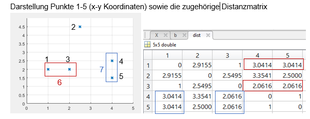
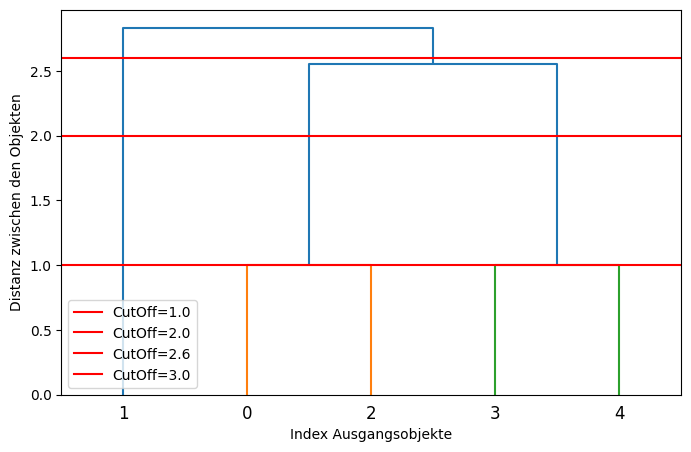
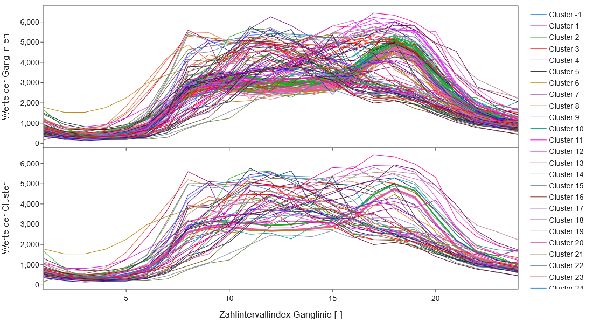
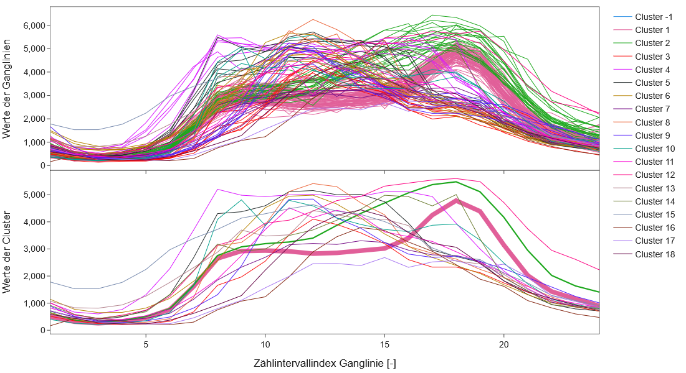
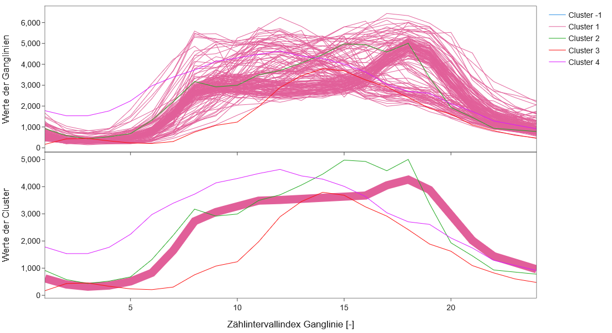
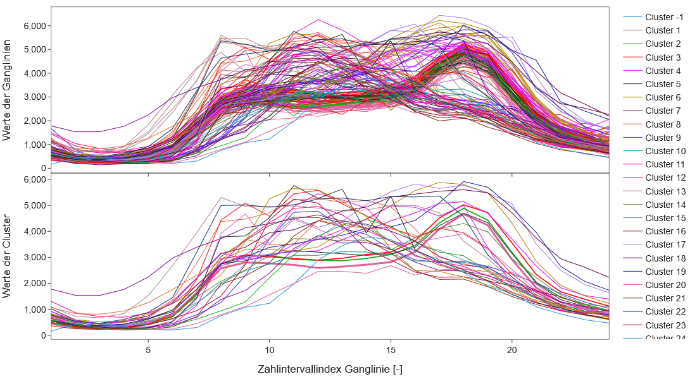

# Grundlagen Clusteranalyse

Diese Seite untersucht verschiedene hierarchische Agglomerationsalgorithmen und die einzelnen Schritte, die sich hinter einer Clusterung verbergen.  
Zuerst werden einzelne Punkte geclustert & danach das Verständnis auf Ganglinien erweitert.  
Anschließend wird die Frage analysiert "Wann ist eine Netzganglinie zu groß".  
Zuletzt wird untersucht, welches Linkage-Verfahren für die Clusterung von Ganglinien angemessen ist.

---

## Für die Clusterung notwendige Begriffe, Definitionen und Abläufe

**Clusterung** = unüberwachtes Machine Learning zur Gruppierung von Daten, basierend auf einem Ähnlichkeitsmaß (=Distanzmaß) und einem Clusteralgorithmus.  

**Klassifizierung** = überwachter Lernprozess zur Gruppierung von Daten. Die Gruppen (=Klassen) sind im Vorfeld bekannt.  

### Funktionsweise einer Clusterung

Zwei Vorgaben sind bei einer Clusterung maßgebend:

- Die Definition des Ähnlichkeitsmaßes  
- Die Auswahl des Clusteralgorithmus  

Ggf. weitere Verfahrensparameter je nach Clusteralgorithmus.  

Nachfolgend werden zwei allgemein anwendbare Algorithmengruppen genannt:

- **Hierarchische Verfahren**  
- **Partitionierende Verfahren**  

---

## Hierarchische Verfahren

Anhand der Distanzmatrix werden Cluster hierarchisch aggregiert (**agglomerative Verfahren**) oder disaggregiert (**divisive Verfahren**).  
Bei den agglomerativen Verfahren wird initial jedes Objekt zu einem Cluster, bei den divisiven Verfahren wird initial ein Cluster gebildet, das alle Objekte enthält.  

In der Praxis werden hauptsächlich agglomerative Verfahren verwendet, deren Vorgehensweise nachfolgend erläutert wird.  
Die Clusteranalyse erfolgt in drei Schritten:

1. Bildung eines Clusterbaums / Zusammenfassung jeweils zweier Clusterobjekte in \( N - 1 \) Schritten.  
   Welche Objekte zusammengefasst werden, hängt von der verwendeten Linkage-Funktion ab.  
2. Definition von Clustern anhand von CutOff-Werten.  
3. Ermittlung der repräsentativen Werte je Cluster.  

### Relevante Linkage-Verfahren zur Ermittlung des Clusterbaums

- **Single Linkage-Verfahren:**  
  Es ermittelt die paarweise größte Ähnlichkeit / geringste Distanz zwischen den Objekten zweier Cluster und wird deshalb auch als **Nearest-Neighbour-Verfahren** bezeichnet.  

  $$ d(A,B) = \min \left(d(x_A ,x_B )\right), \quad \text{mit} \quad x_A \in A, x_B \in B $$  

- **Complete Linkage-Verfahren:**  
  Es ermittelt die paarweise geringste Ähnlichkeit / größte Distanz zwischen den Objekten zweier Cluster und wird deshalb auch als **Farthest-Neighbour-Verfahren** bezeichnet.  

  $$ d(A,B) = \max \left(d(x_A ,x_B )\right), \quad \text{mit} \quad x_A \in A, x_B \in B $$  

- **Average Linkage-Verfahren:**  
  Es verwendet den arithmetischen Mittelwert der paarweisen Distanzen zwischen den Objekten zweier Cluster.  

  $$ d(A,B) = \frac{1}{|A|\cdot |B|} \sum_{x_A \in A, x_B \in B} d(x_A ,x_B ) $$  

- **Centroid Linkage-Verfahren:**  
  Für das Centroid-Verfahren wird die Distanz zwischen den Mittelpunkten (Zentroiden) zweier Cluster berechnet.  

  $$ d(A,B) = d(c_A ,c_B ), \quad \text{mit} \quad c_A =\frac{1}{|A|}\sum_{x_A \in A} x_A ,\quad c_B =\frac{1}{|B|}\sum_{x_B \in B} x_B $$  

- **Ward-Verfahren:**  
  Es verwendet den geringsten Anstieg der Summe der Fehlerquadrate.  

  $$ d(A,B) = \sqrt{\frac{2\cdot |A|\cdot |B|}{|A|+|B|}} \; ||c_A - c_B||_2 $$  

  mit  

  $$ c_A =\frac{1}{|A|} \sum_{x_A \in A} x_A , \quad c_B =\frac{1}{|B|} \sum_{x_B \in B} x_B $$  

**Quellen:** BACKHAUS et al. (2023), DOI: 10.1007/978-3-658-40465-9, scipy Doku + Quellen, Diss MaS  

---

## Partitionierende Verfahren

Partitionierende Verfahren unterteilen die Gesamtheit der Ganglinien in eine vorbestimmte Anzahl von Clustern.  
Beginnend mit einer zufälligen Startzuordnung, wird diese durch iterative Austauschalgorithmen optimiert.  
Dabei kann sich die Gruppenzugehörigkeit einer Ganglinie mehrfach ändern, bis ein festgelegtes Zielkriterium erfüllt ist oder das Verfahren konvergiert.  

Zu den prominenten partitionierenden Methoden zählen:

- **k-Means-Verfahren**  
- **Two-Step-Verfahren**  

Das **k-Means-Verfahren** wird auch als **Clusterzentrenanalyse** bezeichnet, da es darauf abzielt, die Gesamtabweichung der Objekte von den Clusterzentren zu minimieren.  

**Quellen:** BACKHAUS et al. (2023), DOI: 10.1007/978-3-658-40465-9.  

---

## Weitere Begriffe

### Clusterbaum (Agglomerativ, hierarchisch)

Der Clusterbaum ist das Ergebnis einer Linkage-Funktion.  
Er stellt die hierarchische Organisation von \( N \) Objekten dar, die schrittweise zusammengeführt werden.  
Bei jeder Verzweigung werden die nächstgelegenen Cluster zu einem neuen Cluster verbunden.  
Die Verzweigungen repräsentieren die Distanz oder Unähnlichkeit zwischen den Clustern.  

### Dendrogramm

Ein **Dendrogramm** ist eine grafische Darstellung des Clusterbaums.  
Es zeigt die hierarchische Struktur der Clusterung und kann zur Bestimmung sinnvoller CutOff-Werte herangezogen werden.  
Ein gesetzter **CutOff-Wert** im Dendrogramm ermöglicht die Bestimmung einer optimalen Anzahl von Clustern durch das Trennen des Baums auf einer bestimmten Höhe.  
Ohne CutOff-Wert werden final alle Objekte zusammengeführt.  

### Silhouettenwerte und Silhouettendiagramm

**Silhouettenwerte** sind eine Möglichkeit zur quantitativen Beurteilung einer Clusterung.  
Der Silhouettenwert eines zu clusternden Objekts (z. B. einer Ganglinie) gibt an,  
wie ähnlich das Objekt seinem Cluster ist im Vergleich zu den benachbarten Clustern.  

Er entspricht der Differenz der mittleren Ähnlichkeit des Objekts zu den anderen Objekten im Cluster  
und der mittleren Ähnlichkeit des Objekts zu den Objekten des nächstgelegenen Clusters,  
normiert mit dem größeren der beiden Werte.  

Der Wertebereich der Silhouette ist damit \([-1, 1]\):  

- **Je positiver der Wert ist**, desto besser ist die Zugehörigkeit & Ähnlichkeit des Objekts zum identifizierten Cluster.  
- **Werte um 0**: Das Objekt befindet sich an oder sehr nahe an der Grenze zwischen zwei benachbarten Clustern.  
- **Negative Werte**: Das Objekt passt eher zum benachbarten Cluster.  

Der **Silhouettenkoeffizient eines Clusters** ist der Mittelwert der Silhouetten des Clusters.  
Die Darstellung der Silhouetten aller Objekte, sortiert nach Cluster, ist das **Silhouettendiagramm**.  

Wikipedia teilt den Wertebereich der Silhouetten in folgende Klassen ein (ToDo: Verifizieren):

- (0.75, 1]: starke Strukturierung  
- (0.5, 0.75]: mittlere Strukturierung  
- (0.25, 0.5]: schwache Strukturierung  
- (0, 0.25]: keine Strukturierung  


## Untersuchung Clusterung Punktwerte

Koordinaten und Entfernungen

```python
import numpy as np
from scipy.spatial.distance import pdist, squareform

points = np.array([[1, 2], [2.5, 4.5], [2, 2], [4, 2.5],  [4, 1.5]])
dist = pdist(points) # Paar-weise Distanz, vereinfachte Vektordarstellung (dist(k,l)=dist(l,k); dist(k,k)=0)
dist_matr = squareform(dist) # Entfernungsmatrix

print(dist_matr)
```
    [[0.         2.91547595 1.         3.04138127 3.04138127]
     [2.91547595 0.         2.54950976 2.5        3.35410197]
     [1.         2.54950976 0.         2.06155281 2.06155281]
     [3.04138127 2.5        2.06155281 0.         1.        ]
     [3.04138127 3.35410197 2.06155281 1.         0.        ]]


### Vergleich Linkage

Output Linkage: 4 x N-1 Matrix

-  Spalte 1: Cluster A
-  Spalte 2: Cluster B
-  Spalte 3: Distanz
-  Spalte 4: Anzahl an Elemente in gebildetem Cluster
-  N: Anzahl Objekte zum Clustern

```python
from scipy.cluster.hierarchy import linkage
single_lkg = linkage(dist, "single")
print(single_lkg)
```
    [[0.         2.         1.         2.        ]
     [3.         4.         1.         2.        ]
     [5.         6.         2.06155281 4.        ]
     [1.         7.         2.5        5.        ]]
    


```python
complete_lkg = linkage(dist, "complete")
print(complete_lkg)
```

    [[0.         2.         1.         2.        ]
     [3.         4.         1.         2.        ]
     [1.         5.         2.91547595 3.        ]
     [6.         7.         3.35410197 5.        ]]
    


```python
average_lkg = linkage(dist, "average")
print(average_lkg)
```

    [[0.         2.         1.         2.        ]
     [3.         4.         1.         2.        ]
     [5.         6.         2.55146704 4.        ]
     [1.         7.         2.82977192 5.        ]]
    


```python
centroid_lkg = linkage(dist, "centroid")
print(centroid_lkg)
```

    [[0.         2.         1.         2.        ]
     [3.         4.         1.         2.        ]
     [5.         6.         2.5        4.        ]
     [1.         7.         2.51246891 5.        ]]
    


Berechnung des Abstands \( d \) zwischen Cluster 6 (1 & 3) und Cluster 7 (4 & 5)

- **Single Linkage:**  
$$d = \min \left(d_{14} ,d_{15} ,d_{34} ,d_{35} \right) = 2.0616$$

- **Complete Linkage:**  
$$d = \max \left(d_{14} ,d_{15} ,d_{34} ,d_{35} \right) = 3.0414$$
  → 6 & 7 werden nicht gemerged, da \( d_{26} < d_{67} \).

- **Average Linkage:**  
$$d = \frac{1}{4} \left(d_{14} + d_{15} + d_{34} + d_{35} \right) = 2.5515$$

- **Centroid Linkage:**  
$$ d = \text{dist} \left( \left[ 1.5, 2 \right], \left[ 4, 2 \right] \right) = 2.5$$ 
  (Abstand der neuen Mittelpunkte)

### Einfluss CutOff\-Wert
Output fcluster: N x 1 Vektor = Jedem Objekt wird ein Clusterindex zugeordnet

```python
from scipy.cluster.hierarchy import fcluster
# Ergebnis Cluster: jedem Objekt wird ein Clusterindex zugeordnet
zuordnung_cutoff1 = fcluster(average_lkg, t=1, criterion="distance")
print(zuordnung_cutoff1)
```
    [1 3 1 2 2]

```python
zuordnung_cutoff2 = fcluster(average_lkg, t=2, criterion="distance")
print(zuordnung_cutoff2)
```
    [1 3 1 2 2]

```python
zuordnung_cutoff2_5 = fcluster(average_lkg, t=2.5, criterion="distance")
print(zuordnung_cutoff2_5)
```
    [1 3 1 2 2]
    
```python
zuordnung_cutoff2_6= fcluster(average_lkg, t=2.6, criterion="distance")
print(zuordnung_cutoff2_6)
```
    [1 2 1 1 1]

```python
zuordnung_cutoff3 = fcluster(average_lkg, t=3, criterion="distance")
print(zuordnung_cutoff3)
```
    [1 1 1 1 1]
    
Interpretation CutOff\-Werte:

horizontaler Schnitt mit y=CutOff im Dendrogramm. Die einzelne Äste definieren die Cluster. Falls bei dem CutOff\-Wert Äste zusammenlaufen, werden diese noch in Clustern zusammengeführt

```python
from scipy.cluster.hierarchy import dendrogram
from matplotlib import pyplot as plt

# Erstelle das Dendrogramm
fig, ax = plt.subplots(figsize=(8, 5))
dendrogram(average_lkg, ax=ax)

# Achsentitel setzen
ax.set_xlabel("Index Ausgangsobjekte")
ax.set_ylabel("Distanz zwischen den Objekten")

# Füge horizontale Cutoff-Linien hinzu
cutoff_values = [1, 2, 2.6]

for cutoff in cutoff_values:
    ax.axhline(y=cutoff, color='r', linewidth=1.5, label=f'CutOff={cutoff:.1f}')

# Legende anzeigen
ax.legend()

# Diagramm anzeigen
plt.show()
```



## Untersuchung Clusterung Ganglinien (=Vektoren)
Betrachtung 4 Verkehrsstärkevektoren für 4h
```python
data = np.array([
[169, 433, 452, 332],
[357, 247, 229, 256],
[383, 263, 204, 262],
[445, 261, 218, 260],
])
```
### Beispiel mit euklidischer Distanz

```python
dist = pdist(data, 'euclidean');
dist_matr = squareform(dist)
print(dist_matr)
```

    [[  0.         354.18215652 375.63279942 407.06264874]
     [354.18215652   0.          39.91240409  89.87213139]
     [375.63279942  39.91240409   0.          63.62389488]
     [407.06264874  89.87213139  63.62389488   0.        ]]

```python
# Beispiel Berechnung euklidische Distanz zwischen 2 Vektoren
# Distanz zwischen 2 Vektoren: Wurzel aus Skalarprodukt
d12 = np.sqrt((data[0, :] - data[1,:]) @ (data[0, :] - data[1,:]).T)
print(d12)
```
    354.1821565240124
    
Hinweis: bei Abstandsmaße ohne Vektorennorm (GEH, SQV) wird der Abstand der elementweise Abstand berechnet und anschließend der Mittelwert gebildet

```python
single_lkg = linkage(dist, "single")
complete_lkg = linkage(dist, "complete")
average_lkg = linkage(dist, "average")
centroid_lkg = linkage(dist, "centroid")
print("single linkage", "\n", single_lkg)
print("complete linkage", "\n", complete_lkg)
print("average linkage", "\n", average_lkg)
print("centroid linkage", "\n", centroid_lkg)
```
    single linkage 
     [[  1.           2.          39.91240409   2.        ]
     [  3.           4.          63.62389488   3.        ]
     [  0.           5.         354.18215652   4.        ]]
    complete linkage 
     [[  1.           2.          39.91240409   2.        ]
     [  3.           4.          89.87213139   3.        ]
     [  0.           5.         407.06264874   4.        ]]
    average linkage 
     [[  1.           2.          39.91240409   2.        ]
     [  3.           4.          76.74801313   3.        ]
     [  0.           5.         378.95920156   4.        ]]
    centroid linkage 
     [[  1.           2.          39.91240409   2.        ]
     [  3.           4.          75.26121179   3.        ]
     [  0.           5.         377.56780112   4.        ]]
    
### Berechnung Abstand $d$ zwischen Cluster 3 und 4 ( 4 besteht aus 1 & 2):

-  Single Linkage $d=\min \left(d_{42} ,d_{43} \right)=63.6239$
-  Complete Linkage $d=\max \left(d_{42} ,d_{43} \right)=89.721$
-  Average Linkage $d=\frac{1}{2}\cdot \;\left(d_{42} +\;d_{43} \right)=76.748$
-  Centroid Linkage $d=\textrm{dist}\left(\textrm{mean}\left(2,3\right),4\right)=75\ldotp 2612$ (Abstand der neuen Mittelpunkte)

```python
vec12 = np.mean(data[[1,2],:], axis=0)
dist34 = np.sqrt((data[3,:]-vec12) @ (data[3,:]-vec12).T)
print("Distanz Cluster 3 & 4, centroid linkage", dist34)
```
    [[357 247 229 256]
     [383 263 204 262]]
    [370.  255.  216.5 259. ]
    Distanz CLuster 3 & 4, centroid linkage 75.26121178934073

### Beispiel GEH

Umsetzung GEH zwischen Vektoren in _metrics/GEH.m_

-  Berechnung paarweiser GEH\-Werte
-  Wertepaare, bei denen ein Wert nicht vorhanden ist, werden nicht berücksichtigt.
-  Minimaler Wert (1e\-308) wird addiert um Teilung durch 0 zu vermeiden
-  GEH der beiden Vektoren = arithmetischer Mittelwert (ohne NaN)


```python
from modules.metrics import geh
dist = pdist(data, geh);
dist_matr = squareform(dist)
```


```python
single_lkg = linkage(dist, "single")
complete_lkg = linkage(dist, "complete")
average_lkg = linkage(dist, "average")
centroid_lkg = linkage(dist, "centroid")
print("single linkage", "\n", single_lkg)
print("complete linkage", "\n", complete_lkg)
print("average linkage", "\n", average_lkg)
print("centroid linkage", "\n", centroid_lkg)
```

    single linkage 
     [[2.         3.         1.0645727  2.        ]
     [1.         4.         1.10638138 3.        ]
     [0.         5.         9.5493108  4.        ]]
    complete linkage 
     [[ 2.          3.          1.0645727   2.        ]
     [ 1.          4.          1.5644419   3.        ]
     [ 0.          5.         10.48882413  4.        ]]
    average linkage 
     [[2.         3.         1.0645727  2.        ]
     [1.         4.         1.33541164 3.        ]
     [0.         5.         9.99184198 4.        ]]
    centroid linkage 
     [[2.         3.         1.0645727  2.        ]
     [1.         4.         1.24597366 3.        ]
     [0.         5.         9.97254371 4.        ]]
    


Berechnung Abstand $d$ zwischen Cluster 2  und 5 (3 & 4):

-  Single Linkage $$d=\min \left(d_{23} ,d_{24} \right)=1.1064$$
-  Complete Linkage $$d=\max \left(d_{23} ,d_{24} \right)=1.5644$$
-  Average Linkage $$d=\frac{1}{2}\cdot \;\left(d_{23} +\;d_{24} \right)=1.3354$$
- Die Centroid Linkage Berechnung ist nicht sinnvoll, da das Clusterzentrum die euklidische Distanz berücksichtigt.

### Umgang mit Ausfällen
-  unvollständige Wertepaare werden nicht berücksichtigt.

## Einfluss der Länge der Vektoren

Die Distanzberechnung ermittelt genau einen Wert für die Distanz zweier Objekte, um eine zweidimensionale Distanzmatrix aufstellen zu können. Anschließend wird dieser aggregierte Distanzwert in der Clusterung verwendet. Dementsprechend ist die Dimension/Länge der Ganglinie nur in der Distanzberechnung relevant.

-  Die Netzganglinie ist zu groß/ungeeignet, wenn die aggregierte Distanz den Einzeldistanzen zwischen den Wertepaaren zweier Ganglinien nicht gerecht wird.
-  Weiter ist zu beachten, dass der GEH nicht selbstskalierend ist, d.h bei großen Unterschieden in dem Wertebereich der Verkehrsstärken kann es zu Verfälschungen kommen.
-  Die Formähnlichkeit zweier Ganglinien wird sowohl bei der euklidischen Distanz als auch dem GEH nicht berücksichtigt.
-  Einzeldistanzen können die gegebenen CutOff\-Werte deutlich überschreiben.

Umgang mit großen Netzganglinien (Vorschlag MaS, nicht getestet, enthält keine Anpassungen der Clusteralgorithmen):

-  Vorklassifizierung (Tagestypen, Straßenklassen..)
-  Deskriptive Analyse der Verteilung der Einzeldistanzen.
-  Ggf Anpassung Aggregationsfkt Einzeldistanzen.
-  (Distanzmaß implementieren, dass sowohl Form\- als auch Lageähnlichkeit und ggf leichte Verschiebungen berücksichtigt)

## Welches Linkage\-Verfahren ist für die Clusterung von Ganglinien geeignet

(Text aus Diss MaS, Beispiel mit ClusterData.mat erstellt)

-  Ward/Centroid\-Linkage nicht möglich mit GEH als Distanzfunktion
-  Average Linkage als vergleichsweise neutrale Alternative

Das Single Linkage\-Verfahren tendiert dazu, wenige große und viele kleine Cluster zu bilden. Damit kann es vergleichsweise gut Ausreißer ermitteln. Die großen Gruppen sind das Resultat einer Neigung zur Kettenbildung. Das bedeutet, es werden bei der Clusterung primär einzelne Objekte aneinandergereiht, die die großen Cluster bilden. Die Ähnlichkeiten innerhalb des Clusters können dabei vergleichsweise gering sein. Das Complete\-Linkage\-Verfahren tendiert dazu, viele kleine Cluster mit ähnlicher Größe zu erzeugen. Demgegenüber sind die Eigenschaften des Average\-Linkage\- und des Ward\-Verfahrens relativ neutral. Insbesondere das Ward\-Verfahren produziert tendenziell Cluster von vergleichbarer Größe und gilt als ein sehr effektiver Fusionsalgorithmus, allerdings ist seine Anwendbarkeit eingeschränkt (BACKHAUS et al. (2023, S. 521f)). Der Effekt der Kettenbildung kann durch die Anpassung des CutOff\-Werts begrenzt werden. Bei zu geringen CutOff\-Werten repräsentiert ein Cluster nur wenige Objekte und es erfolgt keine relevante Aggregation. Bei hohen Werten nimmt die Homogenität der Objekte eines Clusters ab und die Varianz der Werte innerhalb eines Clusters wird groß.

```python
import modules
from pathlib import Path
import warnings
warnings.filterwarnings('ignore')

file_path = Path.cwd() / "data"  # Beispiel-Pfad zur Eingabedatei

# Daten laden
data = modules.data_handler.load_and_prepare_data(file_path / "ClusterData.mat")

```

Clusterung Average Linkage, CutOff = GEH 5

```python
# Cluster-Objekt erstellen
avg_linkage_cutoff5 = modules.clustering.Clusterung(data, attr_data=data_attributes,
                                          method="average linkage", distance_function="GEH", cutoff=5,
                                          kmeans_preset="random", use_calendar=False)

# Clusterung durchführen
avg_linkage_cutoff5.perform_clustering()
fig,_  = avg_linkage_cutoff5.plots_results()
fig.show()
```
Ganglinien Average Linkage, CutOff = GEH 5



Clusterung Average Linkage, CutOff = GEH 8

```python
# Cluster-Objekt erstellen
avg_linkage_cutoff8 = modules.clustering.Clusterung(data, attr_data=data_attributes,
                                          method="average linkage", distance_function="GEH", cutoff=8,
                                          kmeans_preset="random", use_calendar=False)

# Clusterung durchführen
avg_linkage_cutoff8.perform_clustering()
fig,_  = avg_linkage_cutoff8.plots_results()
fig.show()
```
Ganglinien Average Linkage, CutOff = GEH 8

Clusterung Single Linkage, CutOff = GEH 8

```python
# Cluster-Objekt erstellen
single_linkage_cutoff8 = modules.clustering.Clusterung(data, attr_data=data_attributes,
                                          method="single linkage", distance_function="GEH", cutoff=8,
                                          kmeans_preset="random", use_calendar=False)

# Clusterung durchführen
single_linkage_cutoff8.perform_clustering()
fig,_  = single_linkage_cutoff8.plots_results()
fig.show()
```
Ganglinien Single Linkage, CutOff = GEH 8


Clusterung Complete Linkage, CutOff = GEH 8

```python
# Cluster-Objekt erstellen
cmpl_linkage_cutoff8 = modules.clustering.Clusterung(data, attr_data=data_attributes,
                                          method="complete linkage", distance_function="GEH", cutoff=8,
                                          kmeans_preset="random", use_calendar=False)

# Clusterung durchführen
cmpl_linkage_cutoff8.perform_clustering()
fig,_  = cmpl_linkage_cutoff8.plots_results()
fig.show()
```
Ganglinien Complete Linkage, CutOff = GEH 8

